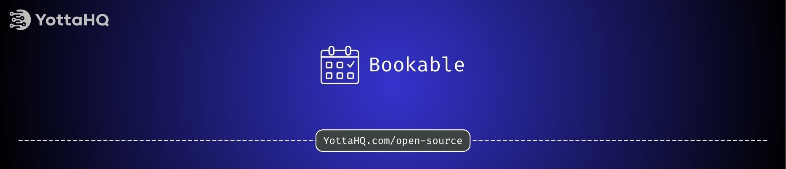

---

# 🗓️ YottaHQ Bookable
A lightweight and flexible Laravel package to add booking functionality to any model in your application.

`yottahq/bookable` provides a standardized way to declare models as bookable and retrieve availability using different configurable strategies.

> 🔖 Currently in beta — includes support for Single Daily Slot Strategy only.

### 📦 Installation
```bash
composer require yottahq/bookable
```

Publish the config and migrations:

```bash
php artisan vendor:publish --provider="YottaHQ\Bookable\BookableServiceProvider"
```

### 📘 Documentation
Full documentation coming soon.
